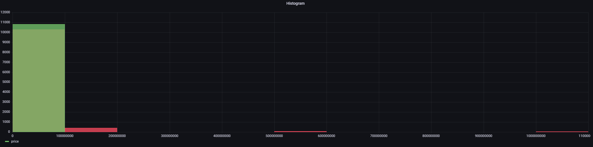

# 빅데이터 처리 기말 과제 프로젝트

## 프로젝트 주제
`Kaggle Play Store Apps Dataset` 을 활용한 app 리뷰 평점 영향 요소 분석


<br/><br/>

## 프로젝트 수행 범위
- 데이터 수집
- 데이터 전처리 및 가공
- 데이터 시각화
- 분석 및 결론 도출

<br/><br/>

## 프로젝트에 사용된 도구(모듈)들
- `pandas` : CSV 파일 내 데이터 정제
- `csv` : CSV 파일 읽기
- `pymysql` : 파이썬용 `mysql` 모듈

<br/><br/>

## 프로젝트 수행 내용
- `Kaggle`의 `Play Store Apps` CSV 데이터를 가져온다.
- 가져온 CSV 데이터를 `pandas` 라이브러리를 통해 읽는다.
- `csv` 모듈과 `pymysql` 모듈을 활용하여 `csv` 파일의 내용을 `mysql` 데이터베이스에 업로드한다.
- `Grafana` 프로젝트에서 `mysql` 데이터를 가져온 후 시각화 표현한다.

<br/><br/>

## 프로젝트 진행 상세 내용

### `Kaggle` 홈페이지에서 `REST API Token` 발행하기
`Kaggle`에 업로드되어 있는 데이터를 `CSV` 파일로 다운로드하는 방법도 있지만, 편리한 데이터 수집을 위해 `Kaggle`에서 제공하는 `REST API`를 활용하여 데이터를 수집한다.
`Kaggle`의 정책 상 `REST API`를 통해 데이터를 수집하려면 `Kaggle`에 화원가입해야 하고, `Account`페이지에서 `API token`을 발행해야 한다.
<br/><br/>


또한, 
- 다운로드한 API Token 파일은 반드시 `C:\Users\[USERNAME]\.kaggle`폴더 안에 있어야 한다.
- 반드시 유효한 토큰으로 진행해야 한다.
- <a href="./kaggle.json">API Token file</a>

<br/>

만약 유효하지 않은 토큰으로 다운로드를 시도할 경우 다음과 같이 `401-Unauthorized` 오류가 발생할 수 있다.
<br/><br/>

<br/><br/>

### `REST API` 를 통해 `Kaggle` 의 데이터 가져오기
<a href="https://kaggle.com">Kaggle</a>에 접속하여 `Play Store Apps` 데이터셋에 진입한다.
<br/><br/>


<br/><br/>

### `REST API Command`를 통해 데이터 다운로드하기
데이터셋 상세 화면의 우측 상단 아이콘을 클릭하면 `API Command`를 복사할 수 있다.
<br/><br/>


<br/><br/>

사전에 `kaggle` 모듈을 다음과 같이 설치하고,
<br/><br/>

<br/><br/>

복사한 명령어를 통해 데이터를 다운로드한다.
정상적으로 다운로드되었다면 다음과 같이 100% 프로세스가 보인다.
<br/><br/>


<br/><br/>
이후 프로젝트 폴더에 `play-store-apps.zip` 파일이 생성(다운로드)된 것을 확인할 수 있다.
<br/><br/>

<br/><br/>
압축 파일의 압축을 풀고, 압축파일명과 동일한 이름의 폴더를 생성하여 해당 폴더로 `csv` 파일들을 옮긴다.
<br/><br/>

<br/><br/>

### `CSV` 파일의 데이터 살펴보기
`pandas` 모듈을 통해 `CSV` 파일의 내용을 읽는다.
<br/><br/>

`get_data.py`
```python
import pandas as pd

data = pd.read_csv(
    "./play-store-apps/googleplaystore.csv",
    header=0,
)

print(data)
```
<br/><br/>

`Result`
<br/><br/>

<br/><br/>

### 데이터베이스 생성 및 연동하기
`AWS (Amazon Web Services)`의 `RDS (Relational Database Service)`를 활용하여 `MySQL` 기반의 <a href="https://aws.amazon.com/ko/rds/">데이터베이스</a> 서비스를 구축하였다.
RDS 는 본 프로젝트의 메인 주제가 아니며, 사전 지식이 필요하므로 상세한 구축 과정은 생략한다.
<br/><br/>


<br/><br/>
RDS 데이터베이스 서비스에 접속하고, 신규 테이블을 생성한다.
<br/><br/>


`pymysql` 모듈을 설치하고, 다음 코드를 통해 `CSV`의 `Row`들을 바로 RDS 데이터베이스 서비스로 업로드한다. `RDS`에서 퍼블릭 액세스를 허용하였으므로 외부 인터넷에서도 직접적으로 접근할 수 있다. (보안 관계 상 프로젝트 종료 후 삭제 예정)
```python
# `CSV` 파일을 읽을 때 필요한 모듈
import csv

# `python`에서 `MySQL` 기반 데이터베이스 서비스와 직접적인 연결을 성립하는 모듈
import pymysql

# 실존하는 RDS의 데이터베이스 정보를 명시하여
# `pymysql` 모듈을 통해 직접적인 데이터베이스 접근을 구현한다.
connect = pymysql.connect(
    host='bigdata.crjw48i2voq5.ap-northeast-2.rds.amazonaws.com',
    user='root',
    password='Han1353130!',
    db='bigdata',
    charset='utf8',
)

# 초기 연결 이후 연결 사항을 저장한다.
curs = connect.cursor()
connect.commit()

# RDS 데이터베이스에 저장할 대상 데이터를
# `Read Mode`와 `UTF-8` CharacterSet 으로 불러온다.
file = open(
    'play-store-apps/googleplaystore.csv',
    'r',
    encoding='UTF-8',
)

# CSV 모듈을 통해 `CSV` 파일을 읽어온다.
csvReader = csv.reader(file)

# `CSV` 파일을 읽어온 데이터를 `row` 항목으로 반복문을 돌리고
for row in csvReader:
    
    # `row` 배열에서 각 `index` 마다 변수화한다.
    app = (row[0])
    category = (row[2])
    ratings = (row[3])
    reviews = (row[4])
    size = (row[5])

    # 각 변수에 데이터가 잘 저장되었는지를 실시간으로 출력한다.
    print(app)
    print(category)
    print(ratings)
    print(reviews)
    print(size)

    # 변수화된 데이터를 실제 데이터베이스 테이블에 입력하는 Query를 선언한다.
    # `data` 는 RDS 데이터베이스 생성 시 기본적으로 생성한 테이블 이름이다.
    # `%s` 를 활용하여 각 `Column`에 입력할 데이터를 대입한다.
    sql = """insert into data
        (
            app,
            category,
            ratings,
            reviews,
            size
        )
        values
        (%s, %s, %s, %s, %s)
    """

    # 사전에 정의한 데이터베이스 연결 객체를 통해 위에 정의한 Query를 실행함으로써
    # 실제 데이터베이스에 데이터를 입력한다.
    curs.execute(
        sql,
        (
            app,
            category,
            ratings,
            reviews,
            size
        )
    )

# 현재까지의 진행 상황을 저장하고,
connect.commit()

# `CSV` 파일의 연결 상태를 종료한다.
file.close()

# 모든 절차가 마무리되었으면, 데이터베이스 연결 세션을 해제한다.
connect.close()
```

작성한 코드를 실행하면, 다음과 같이 `CSV`파일의 데이터가 실시간으로 데이터베이스 서비스에 저장되는 것을 볼 수 있다.
<br/><br/>

<br/><br/>
`connect`객체는 서버 연결 세션이므로, 전체 데이터가 모두 저장된 후 커밋까지 완료되어야 실제 데이터베이스 서비스에 데이터가 입력되었다.

<br/><br/>

`DataGrip`으로 조회한 데이터베이스 테이블


<br/><br/>

### `Grafana` 대시보드와 연동하기
`MySQL`에 저장된 데이터를 기반으로 데이터를 시각화하기 위해 `Grafana`를 활용하였다.<br/>
`Prometheus`도 함께 활용하는 것이 일반적이지만, 본 프로젝트는 데이터 시각화만을 위한 프로젝트이기 때문에 `Grafana`로만 연동을 진행하였다.
> `Grafana` 의 경우 회원가입 절차부터 진행하는 것이 아니고 기존에 사용하는 서비스에 대시보드만 추가하는 작업이어서, 스킵되는 절차가 있을 수 있다.
> 기존에는 `AWS` 로 작업하기 때문에 `S3 Bucket` 에 `Grafana Resource`를 추가하는 등 많은 작업이 있지만, 본 프로젝트에서는 단순히 `MySQL Public Host`에 접근하여 데이터만 가져온다.

<br/><br/>

<a href="https://grafana.com/">Grafana</a> 홈페이지에 접속하여 로그인한다.
로그인 시 기존 프로젝트를 로딩하는 팝업이 몇 초간 발생한다.
<br/><br/>

<br/><br/>

`Grafana` 대시보드에서 `Configuration` -> `Plugins` 메뉴에 진입한다.
<br/><br/>

<br/><br/>

`mysql`을 검색하고, `MySQL` 검색 결과를 클릭한다.


<br/><br/>

상세 화면에서 `Create a MySQL data source`를 클릭한다.
<br/><br/>


<br/><br/>

데이터베이스 관련 정보를 폼에 맞추어 입력한다.
<br/><br/>

<br/><br/>

이후 Explore 페이지에서 MySQL 데이터베이스의 테이블에 대한 데이터를 `Table` 뷰로 볼 수 있다.
<br/><br/>

<br/><br/>

다음과 같이 데이터를 히스토그램 형태로 배치할 수 있다.
<br/><br/>


<br/><br/>

### 결론